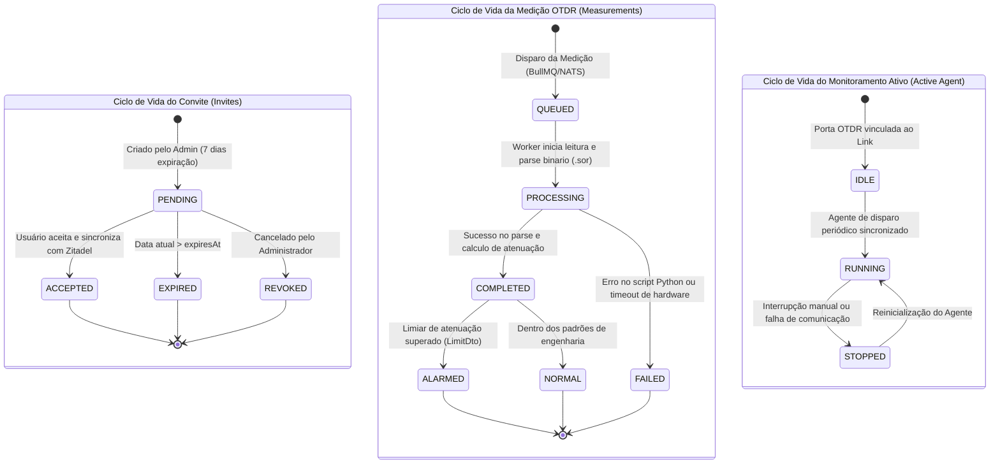
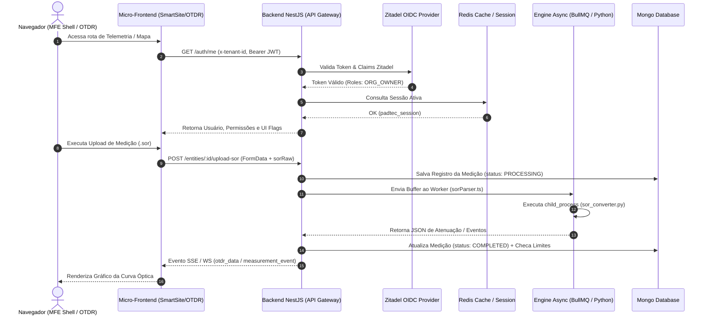
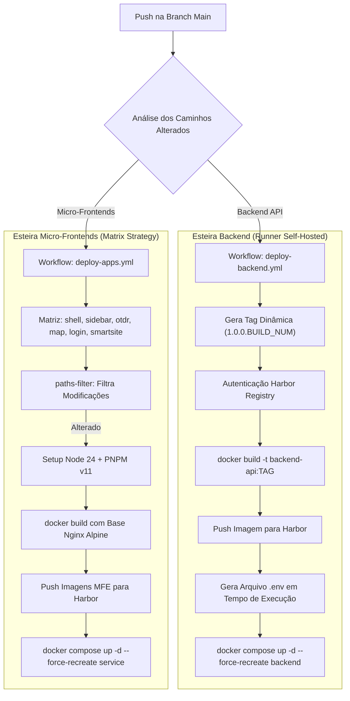

# Relatório de Análise Arquitetural e Regras de Negócio: Smart Fiber Ecosystem

> **Resumo Executivo:** Este relatório apresenta o diagnóstico técnico exaustivo do ecossistema **Smart Fiber**, composto pela plataforma de apresentação em **Micro-frontends (`OTDR-v2`)** e pelo serviço de telemetria e gestão de infraestrutura de fibra óptica em **NestJS (`OTDR_FINAL_BACKEND`)**. O documento detalha a pilha tecnológica, regras de domínio, máquinas de estado, matriz de acesso RBAC/ABAC, contratos de comunicação HTTP/SSE/WebSocket, mapeamento exaustivo de DTOs, arquitetura de contêineres/CI-CD e a avaliação crítica das suítes de testes.

---

## 1. 🛠️ Tecnologias e Versões

A arquitetura do **Smart Fiber Ecosystem** é dividida em duas camadas principais: uma aplicação **Frontend baseada em Micro-frontends (MFEs)** orquestrada por Module Federation e um **Backend Modular em NestJS** integrado a serviços de infraestrutura distribuída (MongoDB, Redis, NATS JetStream e Zitadel).

> [!NOTE]
> **Arquitetura Homogênea em JS/TS:** Não existem módulos legados em Java, Spring Boot ou C#. O ecossistema é inteiramente construído em TypeScript no ciclo de desenvolvimento e Node.js no tempo de execução.

### Mapeamento do Frontend (`OTDR-v2`)

| Categoria | Tecnologia / Ferramenta | Versão Exata | Finalidade e Contexto Operacional |
| :--- | :--- | :--- | :--- |
| **Meta-Framework** | Modern.js (`@modern-js/runtime`, `@modern-js/app-tools`) | `2.68.20` / `2.69.3` | Framework React enterprise com roteamento dinâmico, bundling otimizado e suporte nativo a micro-frontends |
| **Micro-frontends** | Module Federation (`@module-federation/modern-js`) | `^0.21.6` | Carregamento assíncrono de MFEs no cliente (`shell`, `otdr`, `map`, `login`, `sidebar`, `smartsite`) |
| **Biblioteca UI** | React / React DOM | `^18.3.1` | Renderização de componentes de interface Reativa |
| **Linguagem & Runtime** | TypeScript / Node.js | TS `~5.7.3` / Node `>=16.18.1` (CI: Node `24`) | Verificação estática de tipos e compilação do bundle web |
| **Gerenciador de Pacotes** | PNPM | `v11` | Monorepo package manager com links simbólicos e suporte a workspaces (`apps/*`, `packages/*`) |
| **Análise Estática & Lint**| BiomeJS (`@biomejs/biome`) | `1.9.4` | Linter e formatador de código ultrarrápido configurado via `biome.json` e `simple-git-hooks` |
| **Comunicação & HTTP** | Axios | `^1.13.2` | Cliente HTTP com suporte a interceptores REST e controle de cabeçalhos de autenticação/tenant |
| **Streaming / WebSockets** | Socket.io Client | `^4.8.3` | Conexões de baixa latência com namespaces `/telemetry` e `/pins` para dados OTDR em tempo real |
| **Visualização & Gráficos** | Recharts, Echarts, Turf.js | Recharts `^3.8.1`, Echarts `^3.0.5`, Turf `^7.3.4` | Plotagem de curvas de medição óptica OTDR (atenuação x distância) e cálculos geoespaciais GIS |

### Mapeamento do Backend (`OTDR_FINAL_BACKEND`)

| Categoria | Tecnologia / Ferramenta | Versão Exata | Finalidade e Contexto Operacional |
| :--- | :--- | :--- | :--- |
| **Core Framework** | NestJS (`@nestjs/core`, `@nestjs/common`, `@nestjs/microservices`) | `^10.0.0` / `10.4.22` | Arquitetura de microsserviços e API Gateway baseada em injeção de dependência |
| **Linguagem & Runtime** | TypeScript / Node.js | TS `^5.1.3` / Docker `node:20-alpine` | Runtime de execução backend e ambiente de execução em contêiner |
| **Gerenciador de Pacotes** | NPM / PNPM | NPM (Docker builds), PNPM (`pnpm-lock.yaml`) | Resolução de dependências (`npm install --legacy-peer-deps`) |
| **Banco de Dados Principal**| MongoDB Driver (`mongodb`) | `^6.18.0` | Armazenamento de dados sem esquema para topologia física de rede, usuários, medições e logs |
| **Cache & Sessões** | Redis (`ioredis`, `redis`, `connect-redis`) | `ioredis ^5.7.0`, `connect-redis ^9.0.0` | Gerenciamento de sessões Express padronizadas (`padtec_session`) e cache de baixa latência |
| **Fila & Mensageria** | BullMQ & NATS JetStream | `bullmq ^5.71.0`, `nats ^2.29.3` | Filas de processamento assíncrono de medições OTDR e comunicação orientada a eventos |
| **Gestão de Identidade** | Zitadel Client / Passport | `@nestjs/jwt ^11.0.0`, `openid-client ^5.7.1` | Autenticação federada OpenID Connect (OIDC), JWT tokens e RBAC multi-tenant |
| **Feature Management** | Flagsmith & Unleash Client | `flagsmith-nodejs ^6.1.0`, `unleash-client ^6.7.0` | Alternância dinâmica de funcionalidades em tempo real (Feature Flags) |
| **Processamento SOR** | Engine Python Integrada (`sorParser.ts`, `sor_converter.py`) | Python `3.x` via `child_process.spawn` | Leitura binária de arquivos Telcordia GR-196 / SR-4731 `.sor` e conversão em JSON |

---

## 2. 🎯 Regras de Negócio e Domínio

O **Smart Fiber Ecosystem** é projetado para monitoramento ativo e passivo de redes de fibra óptica, gestão de infraestrutura geoespacial de telecomunicações e operação multi-tenant segura.

### Casos de Uso e Fluxos Principais

1. **Gestão Multi-Tenant e Onboarding:**
   - Cada empresa/workspace é tratada como uma organização isolada (`Tenant`).
   - O primeiro usuário de uma empresa registra a conta via `/onboarding/setup`, criando a estrutura da organização no **Zitadel** (`zitadelOrgId`) e gerando a licença principal no MongoDB.
2. **Convites e Licenciamento por Membro:**
   - Administradores convidam membros fornecendo o e-mail e o perfil de acesso (`admin`, `user`, `viewer`).
   - Um token criptográfico randômico de 32 bytes é gerado com expiração fixa de 7 dias (`PENDING`).
   - Ao aceitar o convite, o backend realiza um *hard sync* com o Zitadel (`grantUserOrgRole`) e insere o registro na coleção `licenses` com status `ACTIVE`.
3. **Monitoramento Óptico OTDR e Processamento de Curvas Binárias:**
   - Equipamentos OTDR enviam pulsos ópticos pela fibra e retornam arquivos binários no padrão `.sor`.
   - O sistema realiza a recepção via HTTP ou NATS, invocando a engine `sorParser.ts` que executa o script `sor_converter.py` via `stdin/stdout` para extrair os pontos de refletância e atenuação.
   - Caso os limiares de atenuação (configurados via `CreateLimitDto` com cálculos de engenharia para catenária, folga em caixas e postes) sejam ultrapassados, alarmes automáticos são disparados.
4. **Topologia Física Geoespacial (SmartSite):**
   - Os elementos de rede (Sites e Links) são mapeados em coordenadas geográficas (`Point` e `LineString`).
   - O mapa realiza consultas espaciais baseadas na caixa de visualização ativa (`viewport` / `bbox`), trazendo apenas os componentes visíveis para otimizar o consumo de memória do navegador.

### Ciclo de Vida das Entidades

O diagrama a seguir representa as máquinas de estado que regem as principais entidades do negócio (**Convites de Membros**, **Medições OTDR** e **Agentes de Monitoramento**).



### Regras de Validação e Restrições de Domínio

1. **Unicidade de Membro por Tenant:** Um e-mail não pode ter dois convites pendentes ou duas licenças ativas simultâneas na mesma organização (`ConflictException`).
2. **Isolamento Estrito de Tenant (`TenantGuard`):** Toda requisição não pública exige o cabeçalho HTTP `x-tenant-id`. Se o ID da organização no JWT token do usuário não corresponder ao tenant solicitado, o acesso é bloqueado (`ForbiddenException`).
3. **Cálculo Físico de Distância de Fibra (Catenária):** A distância óptica calculada em um enlace leva em consideração a distância geodésica multiplicada pelo fator de catenária (`catenaryFactor`), somada à folga por caixa de emenda (`slackPerBox`) e folga por poste (`slackPerPole`).
4. **Restrição de Porta OTDR Única:** Uma porta física de um equipamento OTDR só pode estar associada a um agente de monitoramento ativo por vez.

### Matriz de Permissões e Perfis (RBAC / ABAC)

A autorização é gerenciada através da integração entre as roles atribuídas no Zitadel e verificadas pelos Guards do NestJS.

| Perfil (Role) | Mapeamento Zitadel | Recursos Acessíveis | Operações Permitidas (CRUD) |
| :--- | :--- | :--- | :--- |
| **Org Owner / Admin** | `ORG_OWNER` | Todo o workspace, Usuários, Convites, Limites, OTDRs, Infraestrutura e Faturamento | **CRUD Completo:** Criar convites, alterar limiares de engenharia, remover nós, deletar mídias, sincronizar agentes OTDR. |
| **Org Member / User** | `ORG_USER` | Topologia de Rede, Medições OTDR, Mídias, Pins e Leitura de Alertas | **CRU Parcial:** Visualizar rede, disparar medições manuais, importar mídias `.sor`, atualizar coordenadas de pins. Não pode convidar membros ou alterar limiares globais. |
| **Org Viewer** | `ORG_OWNER_VIEWER` | Visualização do Mapa (SmartSite), Histórico de Medições e Status do Sistema | **Leitura Apenas (Read-Only):** `GET` em `/entities`, `/measurements`, `/otdr/limits`. Bloqueado para qualquer mutação `POST`/`PATCH`/`DELETE`. |

---

## 3. 🔌 Contratos de Comunicação, Endpoints e DTOs

### Fluxos Principais de Comunicação

O diagrama abaixo detalha a inter-relação entre as camadas da arquitetura durante a execução de medições ópticas e sincronização em tempo real.



### Tabela Detalhada de Endpoints da API

| Categoria | Método | Rota | Autenticação Exigida | Parâmetros (Path/Query) | Body DTO | Resposta de Sucesso (200/201) | Erros Possíveis |
| :--- | :--- | :--- | :--- | :--- | :--- | :--- | :--- |
| **Auth** | `GET` | `/auth/me` | JWT Bearer | N/A | N/A | Dados do usuário logado e organizações | `401 Unauthorized` |
| **Auth** | `POST` | `/auth/refresh` | Public | N/A | `{ refreshToken: string }` | Novo JWT Access Token | `400 Bad Request`, `401` |
| **Auth** | `POST` | `/auth/me/ui-flags` | JWT Bearer | N/A | `{ product: string, flag: string, value: any }` | State atualizado de flags | `400 Bad Request` |
| **Invites** | `POST` | `/invites` | JWT Bearer (Admin) | N/A | `{ email: string, role: string }` | `{ success: true, message: string }` | `400`, `409 Conflict` |
| **Invites** | `GET` | `/invites/details/:token` | Public | Path: `token` | N/A | `{ tenantName, invitedByName, role, email }` | `404 Not Found`, `400 Expired` |
| **Invites** | `POST` | `/invites/accept` | JWT Bearer | N/A | `{ token: string }` | `{ success: true, tenantId: string }` | `400`, `403 Forbidden`, `500` |
| **Onboarding**| `POST` | `/onboarding/setup` | JWT Bearer | N/A | `SetupAccountDto` | `{ tenantId: string, status: string }` | `400`, `409 Conflict` |
| **License** | `GET` | `/license/active` | JWT Bearer | Query: `product` | N/A | Dados da licença e limites | `404 Not Found` |
| **Entities** | `GET` | `/entities/viewport` | JWT Bearer | Query: `bounds` (`ViewportDto`) | N/A | GeoJSON FeatureCollection de elementos | `400 Bad Request` |
| **Entities** | `POST` | `/entities` | JWT Bearer | N/A | `CreateEntityDto` | Objeto da entidade criada com `_id` | `400 Validation Error` |
| **Entities** | `POST` | `/entities/:id/upload-sor`| JWT Bearer | Path: `id` | FormData (`file`, `otdrId`, `port`) | Objeto do traço analisado | `400 Invalid SOR Format` |
| **Entities** | `PATCH`| `/entities/move` | JWT Bearer | N/A | `UpdateOrderItemDto[]` | Status de reordenação | `400 Bad Request` |
| **Pins** | `POST` | `/pins` | JWT Bearer | N/A | `CreatePinDto` | Pin geoespacial criado | `400 Validation Error` |
| **OTDR** | `POST` | `/otdr/test-connection` | JWT Bearer | N/A | `TestConnectionDto` | `{ connected: boolean, latencyMs: number }` | `504 Gateway Timeout` |
| **OTDR** | `PATCH`| `/otdr/limits` | JWT Bearer | N/A | `CreateLimitDto` | Configuração de limiares salva | `400 Bad Request` |
| **OTDR** | `POST` | `/otdr/measure/:otdrId/:port` | JWT Bearer | Path: `otdrId`, `port` | Options de medição | ID da medição em fila | `500 Hardware Error` |
| **Measurements**| `GET`| `/measurements/:id/download`| JWT Bearer | Path: `id` | N/A | Stream `application/octet-stream` (.sor) | `404 Not Found` |
| **Monitoring** | `POST` | `/monitoring/:otdrId/:port/sync-agent` | JWT Bearer | Path: `otdrId`, `port` | N/A | Status do agente ativo | `409 Agent Conflict` |

### Mapeamento Exaustivo de DTOs e Interfaces

Abaixo estão as definições exatas em código TypeScript dos DTOs centrais que sustentam as validações do backend via `class-validator` e `class-transformer`.

```typescript
// 1. DTO de Configuração de Limites de Engenharia Óptica (src/otdr/dto/create-limit.dto.ts)
import { IsNumber, IsOptional, IsString, ValidateNested } from 'class-validator';
import { Type } from 'class-transformer';

export class EngSpecsDto {
  @IsNumber()
  catenaryFactor: number; // Fator de sobredistância geodésica (ex: 1.05)

  @IsNumber()
  avgSpanBetweenBoxes: number; // Vão médio entre caixas de emenda em metros

  @IsNumber()
  avgSpanBetweenPoles: number; // Vão médio entre postes consecutivos em metros

  @IsNumber()
  slackPerBox: number; // Metragem de folga técnica de fibra em cada caixa de emenda

  @IsNumber()
  slackPerPole: number; // Metragem de folga técnica por poste reservado
}

export class CreateLimitDto {
  @IsString()
  linkId: string; // Identificador único do enlace óptico no banco de dados

  @IsNumber()
  maxAttenuation: number; // Limiar máximo de atenuação tolerada em dB (ex: 0.35)

  @IsOptional()
  @ValidateNested()
  @Type(() => EngSpecsDto)
  engSpecs?: EngSpecsDto; // Especificações detalhadas de cálculo físico
}

// 2. DTO de Inicialização de Organização (src/onboarding/dto/setup-account.dto.ts)
import { IsString, IsNotEmpty, IsIn } from 'class-validator';

export class SetupAccountDto {
  @IsString()
  @IsNotEmpty()
  companyName: string; // Nome fantasia ou razão social da empresa contratante

  @IsString()
  @IsNotEmpty()
  @IsIn(['starter', 'pro', 'enterprise'])
  plan: string; // Nível da licença adquirida para o workspace
}

// 3. DTO Polimórfico de Criação de Entidades de Mapa (src/entities/dto/create-entity.dto.ts)
import { IsString, IsNotEmpty, IsOptional, IsMongoId, IsEnum, ValidateNested, IsArray, ArrayMinSize, ArrayMaxSize, IsNumber, IsIn, ValidateIf } from 'class-validator';
import { Type } from 'class-transformer';

export enum EntityType {
  FOLDER = 'folder',
  SITE = 'site',
  LINK = 'link',
}

export class SiteGeometryDto {
  @IsIn(['Point'])
  type: 'Point'; // Tipo da geometria GeoJSON para Sites/Pins

  @IsArray()
  @ArrayMinSize(2)
  @ArrayMaxSize(2)
  @IsNumber({}, { each: true })
  coordinates: number[]; // Coordenadas geográficas no formato [Longitude, Latitude]
}

export class LinkGeometryDto {
  @IsIn(['LineString'])
  type: 'LineString'; // Tipo de geometria para trajetos ópticos

  @IsArray()
  @IsArray({ each: true })
  coordinates: number[][]; // Matriz de pontos [Longitude, Latitude] formando a linha
}

export class CreateEntityDto {
  @IsEnum(EntityType)
  readonly type: EntityType; // Tipo da entidade topológica

  @IsString()
  @IsNotEmpty()
  readonly name: string; // Nome de exibição da estrutura no mapa

  @IsOptional()
  @IsMongoId()
  readonly parentId?: string; // ID da pasta ou grupo pai

  @ValidateIf(o => o.type === EntityType.LINK)
  @IsNotEmpty()
  @IsMongoId()
  readonly startPinId?: string; // ID do Site/Pin de origem do enlace

  @ValidateIf(o => o.type === EntityType.LINK)
  @IsNotEmpty()
  @IsMongoId()
  readonly endPinId?: string; // ID do Site/Pin de destino do enlace

  @ValidateIf(o => o.type !== EntityType.FOLDER)
  @IsNotEmpty()
  @ValidateNested()
  @Type(() => Object, {
    keepDiscriminatorProperty: true,
    discriminator: {
      property: 'type',
      subTypes: [
        { value: SiteGeometryDto, name: 'Point' },
        { value: LinkGeometryDto, name: 'LineString' },
      ],
    },
  })
  readonly geometry?: SiteGeometryDto | LinkGeometryDto; // Dados espaciais GeoJSON
}

// 4. DTO de Teste de Conectividade OTDR (src/otdr/dto/test-connection.dto.ts)
import { Transform } from 'class-transformer';

export class TestConnectionDto {
  @IsString()
  identifier: string; // Nome ou serial do equipamento OTDR

  @IsString()
  ip: string; // Endereço IPv4/IPv6 do equipamento no parque industrial

  @IsOptional()
  @IsNumberString()
  @Transform(({ value }) => (value === '' ? undefined : value))
  porta?: string; // Porta de comunicação IP (default: 8080/4000)

  @IsString()
  usuario: string; // Credencial de autenticação no hardware

  @IsString()
  senha: string; // Senha de acesso ao equipamento OTDR
}
```

---

## 4. 📦 Infraestrutura e Deploy

### Pipeline CI/CD de Build e Deploy

A esteira de integração e entrega contínua é dividida em dois fluxos automatizados executados por um **GitHub Actions Self-Hosted Runner**.



### Análise de Containers e Servidores Web

1. **Backend API Contêiner (`OTDR_FINAL_BACKEND/Dockerfile`):**
   - **Estágio 1 (Builder):** Imagem base `node:20-alpine`, executa `npm install --legacy-peer-deps` e realiza a compilação do TypeScript para JavaScript na pasta `/dist`.
   - **Estágio 2 (Production):** Imagem limpa `node:20-alpine`, copia apenas o `package.json`, instala dependências de produção (`npm install --only=production`), copia a pasta `dist` compilada e expõe a porta `4000`. Executado via `CMD ["node", "dist/src/main"]`.
2. **Frontend Micro-Frontends (`OTDR-v2/Dockerfile`):**
   - Base `nginx:alpine` utilizando arquivo customizado `nginx-docker.conf` e copiando a pasta `/dist` gerada no build para `/usr/share/nginx/html`.
3. **Proxy Reverso Central (`nginx-proxy.conf`):**
   - Um contêiner Nginx escuta nas portas locais `8081` e `8082` operando como gateway de roteamento e redirecionando as chamadas para a rede interna `mfe-network` entre os serviços `mfe-shell`, `mfe-login`, `mfe-otdr`, `mfe-map`, `mfe-smartsite` e `backend`.

### Diagnóstico de Divergências de Infraestrutura

> [!WARNING]
> **Inconsistências Críticas de Portas, Variáveis e Dependências de Runtime:**
> 1. **Conflito de Porta de Exposição do Backend (3000 vs 4000):**
>    - O arquivo `OTDR_FINAL_BACKEND/docker-compose.yml` declara `expose: - "3000"`.
>    - Porém, o workflow de deploy (`.github/workflows/deploy-backend.yml`, linha 56) injeta dinamicamente no `.env` a variável `PORT=4000`.
>    - Caso o proxy Nginx tente efetuar o pass-through para a porta `3000`, a conexão retornará erro **502 Bad Gateway**.
> 2. **Hardcode da Porta do Redis no Bootstrap de Produção:**
>    - No arquivo `src/main.ts` (linhas 35-36), a conexão do gerenciador de sessões `connect-redis` está configurada com endereço e porta estáticos apontando para `localhost:6380`.
>    - Em contrapartida, o `app.module.ts` utiliza o `ConfigService` lendo a variável `REDIS_PORT` (com fallback para `6379`). Em contêineres de produção isolados, isso provoca falha catastrófica no bootstrap da sessão.
> 3. **Ausência da Engine Python na Imagem Docker de Produção:**
>    - A classe `sorParser.ts` executa `spawn("python", ["src/otdr/sor_converter.py", "--stdin"])` para processar arquivos de medição óptica `.sor`.
>    - A imagem Docker de produção (`FROM node:20-alpine`) **NÃO instala o pacote `python3` ou `py3-pip`**. Qualquer tentativa de upload ou análise de arquivo `.sor` em ambiente conteinerizado resultará em um erro não capturado de execução de processo (`ENOENT`).
> 4. **Hardcode de WebSocket com Localhost no Frontend:**
>    - O arquivo `apps/smartsite-mfe/src/hooks/useSmartSiteLive.ts` (linhas 7 e 18) possui a conexão Socket definindo explicitamente o host `http://localhost:4000/pins`. Em homologação e produção, clientes em outras máquinas não conseguirão receber telemetria live.

---

## 5. 🧪 Testes e Qualidade

### Métricas de Cobertura por Camada

| Camada | Framework de Testes | Linter / Análise Estática | Volume de Testes Existentes |
| :--- | :--- | :--- | :--- |
| **Backend (`OTDR_FINAL_BACKEND`)** | Jest `^29.5.0` & Supertest `^7.0.0` | ESLint `^8.0.0` / Prettier `^3.0.0` | 10 arquivos `.spec.ts` contendo apenas testes de fumaça gerados pelo CLI (`expect(service).toBeDefined()`). 1 arquivo E2E boilerplate (`app.e2e-spec.ts`). |
| **Frontend (`OTDR-v2`)** | `@types/jest ~29.2.4` (Instalado apenas tipo) | BiomeJS `1.9.4` & Git Hooks | **0 arquivos de teste (Zero specs ou testes unitários/E2E).** |

### Localização das Suítes no Repositório

- **Testes Unitários Backend:** Dispersos na pasta `src/` ao lado dos respectivos controllers e services (ex: `src/pins/pins.service.spec.ts`, `src/alarms/alarms.service.spec.ts`).
- **Testes E2E Backend:** Localizados na raiz na pasta `test/` (`test/app.e2e-spec.ts` com configuração em `test/jest-e2e.json`).
- **Frontend:** Nenhuma suíte de testes configurada.

### Avaliação Crítica da Efetividade da Suíte

> [!IMPORTANT]
> **Débito Técnico Crítico e Falta de Testes das Regras de Negócio:**
> 1. **Falsa Sensação de Cobertura no Backend:** Todos os arquivos de teste unitário existentes limitam-se a instanciar o módulo do NestJS e checar se o serviço foi definido (`expect(service).toBeDefined()`). Nenhuma regra de negócio (como cálculo de catenária, validações do `TenantGuard`, permissões RBAC do Zitadel ou limites de atenuação) possui testes asserindo valores.
> 2. **Falha na Execução da Suíte E2E:** O único teste End-to-End (`test/app.e2e-spec.ts`) tenta inicializar o `AppModule` completo sem fornecer instâncias de mock para a conexão do MongoDB, Redis ou NATS. Ao executar `npm run test:e2e`, a execução é abortada por erro de conexão com banco de dados.
> 3. **Ausência Completa de Testes no Frontend:** Todos os seis micro-frontends (`shell`, `login-mfe`, `otdr-mfe`, `map-mfe`, `sidebar-mfe`, `smartsite-mfe`) carecem de testes unitários de componente (React Testing Library) ou testes ponta a ponta (Cypress/Playwright). A integridade do código depende exclusivamente da validação de sintaxe efetuada pelo BiomeJS.
