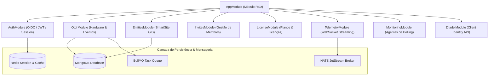

# BE-OVERVIEW-200: Visão Geral do Backend NestJS

> **Resumo Executivo:** O backend da plataforma é estruturado como um **Monólito Modular em NestJS 10**, projetado para suportar alta concorrência no processamento de medições OTDR e integração com serviços de mensageria assíncrona.

---

## 🎯 Visão Geral da Arquitetura

O projeto `OTDR_FINAL_BACKEND` adota os princípios de injeção de dependência e módulos isolados promovidos pelo NestJS.

---

## 📐 Principais Módulos do Sistema

1. **`AuthModule`:** Estratégias Passport JWT, gerenciamento de sessões Express no Redis (`padtec_session`) e validação de claims Zitadel.
2. **`OtdrModule`:** Processamento de conexões IP com refletores OTDR, persistência de limites de engenharia (`limits`) e orquestração do parser Python binário.
3. **`EntitiesModule`:** Manipulação de coleções GIS (Sites e Links), cálculo de bounding box (`viewport`) e streaming de arquivos de mídia via GridFS.
4. **`InvitesModule`:** Criação e aceitação de convites com sincronização rigorosa de papéis no Zitadel (`grantUserOrgRole`).
5. **`TelemetryModule`:** Gateways de WebSocket Socket.io para transmissão assíncrona de medições ópticas.

---

## 🔗 Conexões no Grafo (Dependências)
* **Nó Raiz:** [ROOT-INDEX-000: Grafo de Conhecimento](../index.md)
* **Visão Geral Global:** [SYS-OVERVIEW-001: Visão Geral Integrada](../overview.md)
* **Tabela de Endpoints:** [BE-API-201: Endpoints API](./api/endpoints.md)
* **Core Services:** [BE-SERV-202: Serviços Backend](./services/core-services.md)
* **DTOs e Schemas:** [BE-MODEL-203: DTOs e Schemas](./models/dtos-and-entities.md)
