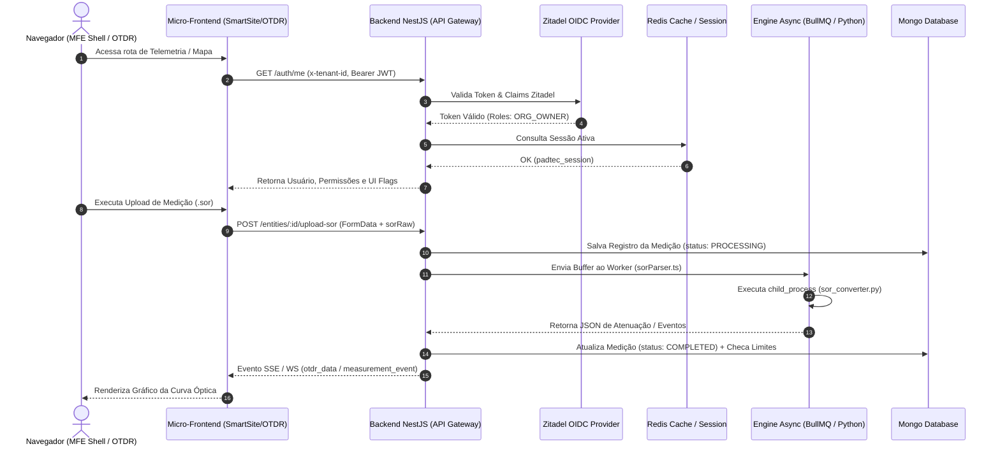
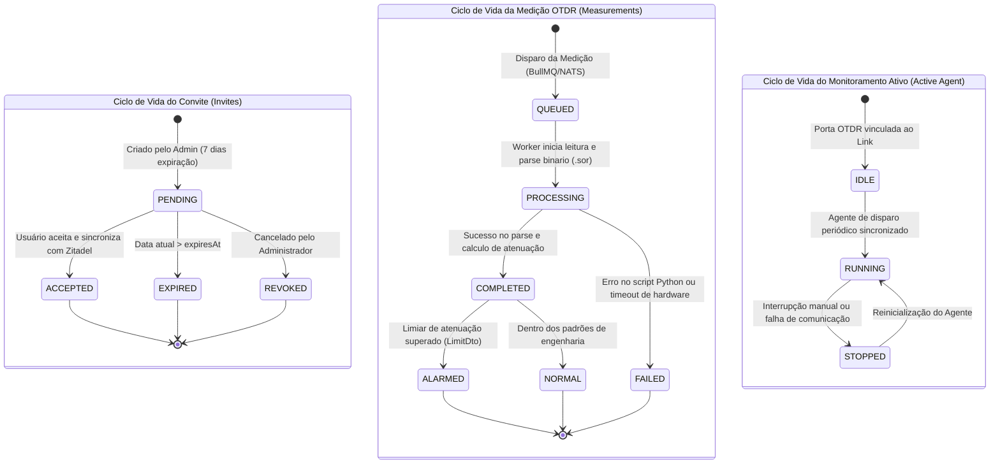

# DOM-FLOWS-012: Fluxogramas e Máquinas de Estado

> **Resumo Executivo:** Especificação visual dos fluxos críticos de comunicação sequencial e transição de estados das entidades centrais da plataforma.

---

## 🎯 1. Diagrama de Sequência: Autenticação & Telemetria OTDR

---

## 🎯 2. Diagrama de Estados: Ciclos de Vida das Entidades

---

## 🔗 Conexões no Grafo (Dependências)
* **Visão Geral do Domínio:** [DOM-OVERVIEW-010: Visão Geral](./overview.md)
* **Regras de Negócio:** [DOM-RULES-011: Regras e RBAC](./regras-de-negocio.md)
