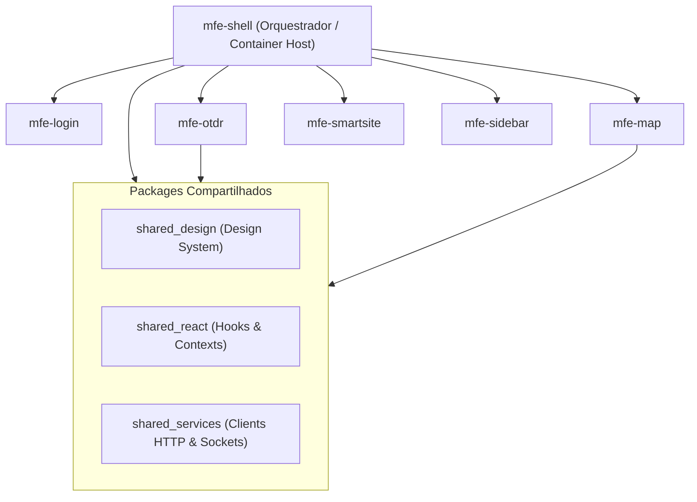

# FE-OVERVIEW-100: Visão Geral do Frontend

> **Resumo Executivo:** A camada de interface do usuário do ecossistema Smart Fiber é construída sobre uma arquitetura de **Micro-Frontends (MFEs)** orquestrada pelo framework **Modern.js** e **Module Federation**, permitindo builds e deploys independentes para cada módulo da plataforma.

---

## 🎯 Visão Geral da Arquitetura MFE

A aplicação `OTDR-v2` utiliza a abordagem de micro-frontends para separar as responsabilidades visuais da plataforma em seis aplicações autônomas e três pacotes de código compartilhado.

---

## 📐 Tecnologias e Otimizações de Build

1. **Meta-Framework Modern.js (`2.68.20`):** Prover estrutura React enterprise com suporte a bundling ultra-otimizado e gerenciamento nativo de exposições de Module Federation.
2. **Monorepo com PNPM Workspaces (`v11`):** Gerenciamento eficiente de dependências compartilhadas via links simbólicos sem duplicação de pacotes em disco.
3. **Análise Estática com BiomeJS (`1.9.4`):** Formatação de código e verificação de lint executada instantaneamente nos hooks de pre-commit.
4. **Visualização de Gráficos e GIS:** Integração com **Recharts** e **Echarts** para curvas de atenuação OTDR e **Turf.js** para cálculos espaciais de polígonos e distâncias no mapa.

---

## 🔗 Conexões no Grafo (Dependências)
* **Nó Raiz:** [ROOT-INDEX-000: Grafo de Conhecimento](../index.md)
* **Visão Geral Global:** [SYS-OVERVIEW-001: Visão Geral Integrada](../overview.md)
* **Componentes MFE:** [FE-COMP-101: Micro-Frontends](./components/micro-frontends.md)
* **API Client & WebSockets:** [FE-SERV-102: Client Services](./services/api-client.md)
