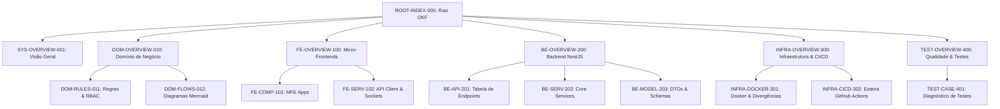

# ROOT-INDEX-000: Grafo de Conhecimento - Smart Fiber Ecosystem

> **Resumo Executivo:** Nó central de navegação e mapa do Grafo de Conhecimento da plataforma Smart Fiber, conectando os domínios de negócio, micro-frontends, backend NestJS, infraestrutura Docker e diagnóstico de qualidade.

---

## 🎯 Visão Geral do Grafo

A documentação OKF (Open Knowledge Format) da plataforma **Smart Fiber** está estruturada de forma atômica e interligada. Navegue pelos nós do grafo abaixo conforme o interesse técnico:

---

## 📐 Mapa de Navegação por Módulo

### 1. Sistema e Arquitetura Global
* [SYS-OVERVIEW-001: Visão Geral Integrada](./overview.md) - Arquitetura de alto nível, stack e premissas.

### 2. Domínio e Regras de Negócio (`/domain`)
* [DOM-OVERVIEW-010: Visão Geral do Domínio](./domain/overview.md) - Engenharia óptica OTDR e telecomunicações.
* [DOM-RULES-011: Regras de Negócio e Matriz RBAC](./domain/regras-de-negocio.md) - Cálculos físicos, isolamento multi-tenant e permissões Zitadel.
* [DOM-FLOWS-012: Fluxogramas e Máquinas de Estado](./domain/fluxogramas.md) - Sequências OIDC/WS e ciclos de vida de entidades.

### 3. Camada Frontend - Micro-Frontends (`/frontend`)
* [FE-OVERVIEW-100: Visão Geral do Frontend](./frontend/overview.md) - Arquitetura Modern.js e Module Federation (`OTDR-v2`).
* [FE-COMP-101: Mapeamento de Micro-Frontends](./frontend/components/micro-frontends.md) - Estrutura dos MFEs (`shell`, `otdr`, `map`, `login`, `smartsite`, `sidebar`).
* [FE-SERV-102: Clientes HTTP e WebSockets](./frontend/services/api-client.md) - Axios interceptors, refresh token e conexões Socket.io live.

### 4. Camada Backend - NestJS API (`/backend`)
* [BE-OVERVIEW-200: Visão Geral do Backend](./backend/overview.md) - Estrutura modular NestJS (`OTDR_FINAL_BACKEND`).
* [BE-API-201: Compilação Exaustiva de Endpoints](./backend/api/endpoints.md) - Tabela completa de rotas HTTP, SSE e WebSocket.
* [BE-SERV-202: Serviços de Negócio e Parser Python](./backend/services/core-services.md) - Integração com `sorParser.ts`, Zitadel, MongoDB e NATS.
* [BE-MODEL-203: DTOs e Schemas de Dados](./backend/models/dtos-and-entities.md) - Definições de código TypeScript dos DTOs com `class-validator`.

### 5. Infraestrutura, Docker e CI/CD (`/infra`)
* [INFRA-OVERVIEW-300: Visão Geral da Infraestrutura](./infra/overview.md) - Topologia de deploy em contêineres e proxy.
* [INFRA-DOCKER-301: Containers e Divergências Críticas](./infra/docker/containers.md) - Dockerfiles, Nginx proxy e alertas `> [!WARNING]`.
* [INFRA-CICD-302: Esteiras CI/CD GitHub Actions](./infra/CI/pipelines.md) - Pipelines de build e publicação no Harbor Registry.

### 6. Qualidade de Software e Suítes de Teste (`/testing`)
* [TEST-OVERVIEW-400: Visão Geral da Estratégia de Qualidade](./testing/overview.md) - Estado atual da automação de testes.
* [TEST-CASE-401: Diagnóstico Crítico de Testes](./testing/test-cases/diagnostico-qualidade.md) - Avaliação de cobertura e débito técnico (`> [!IMPORTANT]`).

---

## 🔗 Conexões no Grafo (Dependências)
* **Log de Atualizações:** [Log OKF](./log.md)
* **Guia de Estilo:** [OKF Style Guide](./OKF_STYLE_GUIDE.md)
