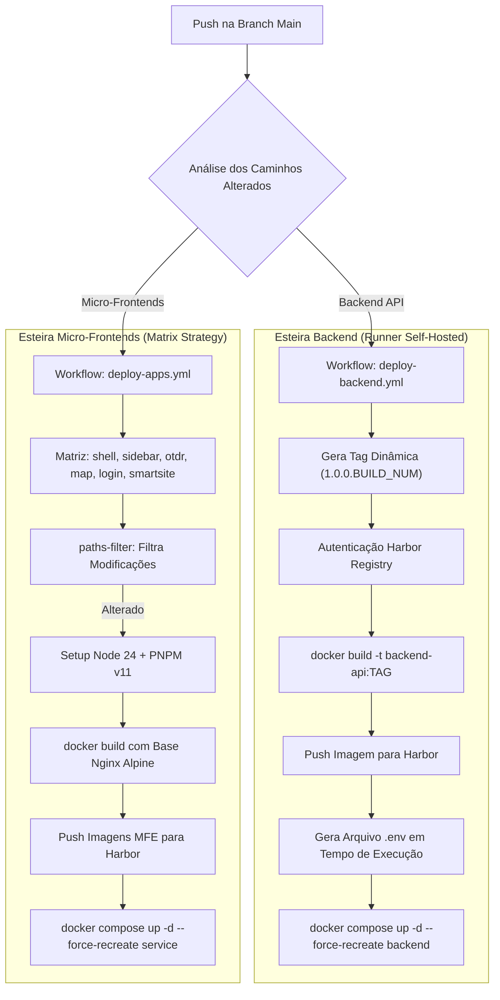

# INFRA-CICD-302: Esteira CI/CD GitHub Actions

> **Resumo Executivo:** Especificação dos fluxos de build, conteinerização e publicação automatizada de imagens no Harbor Registry via GitHub Actions Self-Hosted Runner.

---

## 🎯 Fluxograma das Esteiras de Implantação

---

## 📐 Detalhamento dos Workflows

### 1. Backend (`deploy-backend.yml`)
- Disparado em alterações na pasta `src/` ou arquivos Docker.
- Calcula a versão dinâmica concatenando a versão base com o número da execução (`1.0.0.${run_number}`).
- Efetua a compilação, envia a imagem para o Harbor Registry corporativo (`gitops/backend-api`) e injeta os segredos do repositório no arquivo `.env` local do servidor antes de recriar o contêiner via Docker Compose.

### 2. Frontend (`deploy-apps.yml`)
- Utiliza uma estratégia de matriz (`matrix strategy`) para construir e implantar individualmente cada um dos seis micro-frontends (`shell`, `sidebar-mfe`, `otdr-mfe`, `map-mfe`, `login-mfe`, `smartsite-mfe`).
- Utiliza a ação `dorny/paths-filter` para evitar builds desnecessários de MFEs que não sofreram alterações na branch main.

---

## 🔗 Conexões no Grafo (Dependências)
* **Visão Geral da Infra:** [INFRA-OVERVIEW-300: Visão Geral](../overview.md)
* **Docker & Divergências:** [INFRA-DOCKER-301: Docker Containers](../docker/containers.md)
