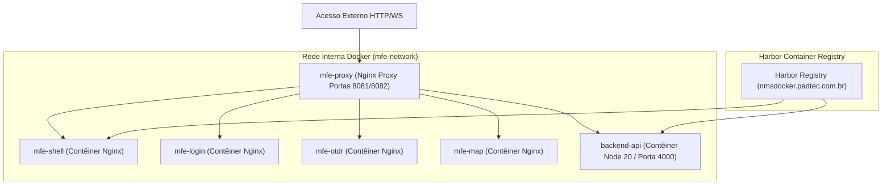

# INFRA-OVERVIEW-300: Visão Geral da Infraestrutura

> **Resumo Executivo:** O ecossistema Smart Fiber adota uma estratégia de implantação inteiramente baseada em contêineres Docker, orquestrada por **Docker Compose** e automatizada via **GitHub Actions** em runners corporativos self-hosted.

---

## 🎯 Topologia da Infraestrutura

---

## 📐 Estrutura de Comunicação e Portas

- **Proxy Central (`mfe-proxy`):** Escuta nas portas de host `8081` e `8082`, efetuando o repasse de chamadas para o shell de micro-frontends e para a API backend.
- **Backend API (`backend-api`):** Escuta na porta interna `4000`, processando requisições REST/SSE/WS.

---

## 🔗 Conexões no Grafo (Dependências)
* **Nó Raiz:** [ROOT-INDEX-000: Grafo de Conhecimento](../index.md)
* **Visão Geral Global:** [SYS-OVERVIEW-001: Visão Geral Integrada](../overview.md)
* **Docker & Divergências:** [INFRA-DOCKER-301: Docker & Alertas](./docker/containers.md)
* **Pipelines CI/CD:** [INFRA-CICD-302: GitHub Actions](./CI/pipelines.md)
