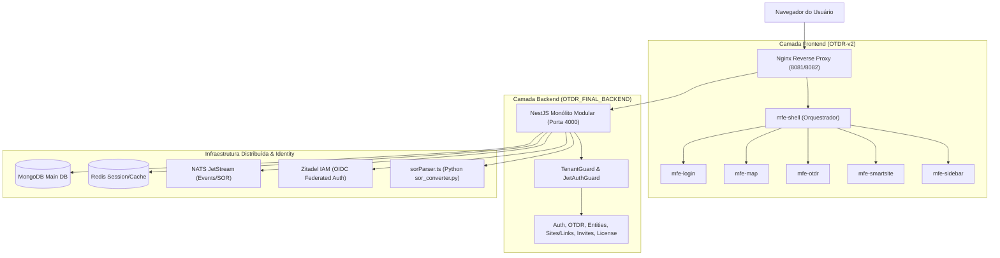

# SYS-OVERVIEW-001: Visão Geral Integrada da Arquitetura Smart Fiber

> **Resumo Executivo:** O ecossistema **Smart Fiber** é uma solução de alta performance para monitoramento de infraestrutura de fibra óptica, unindo uma arquitetura de **Micro-Frontends (MFEs)** em React/Modern.js a um **Monólito Modular em NestJS** integrado ao Zitadel OIDC e processadores de sinalização óptica `.sor`.

---

## 🎯 Visão Geral do Sistema

A plataforma foi desenvolvida para atender operadoras e provedores de telecomunicações no acompanhamento em tempo real da saúde da malha óptica, detecção de atenuações e gerenciamento físico de ativos geoespaciais (Sites e Links).

---

## 📐 Premissas Arquiteturais e Padrões de Projeto

### 1. Separação Estrita de Responsabilidades (Decoupled Frontend/Backend)
- A camada de apresentação é totalmente desacoplada e distribuída através de **Micro-frontends** orquestrados via **Module Federation**. O cliente consome o backend estritamente via APIs RESTful, Server-Sent Events (SSE) e WebSockets.

### 2. Autenticação Federada e Identidade Centralizada (Zitadel OIDC)
- Toda gestão de identidades, logins sociais/SAML e permissões de usuários em organizações (`tenants`) é delegada ao **Zitadel**. O backend injeta as permissões dinamicamente no JWT baseando-se nos claims `urn:zitadel:iam:org:project:roles`.

### 3. Contexto Multi-Tenant com Guardas Declarativos
- Toda requisição HTTP autenticada transmite o cabeçalho `x-tenant-id`. No backend, o `TenantGuard` intercepta a requisição e valida se a licença e o usuário possuem autorização ativa para a organização solicitada.

### 4. Processamento de Sinais Ópticos (.sor) em Pipeline Híbrido
- Arquivos binários de reflectometria óptica no formato Telcordia GR-196 (`.sor`) são recebidos pela API e encaminhados para a engine binária Python (`sor_converter.py`) via `stdIO`. A atenuação resultante é comparada com os limiares de engenharia configurados no enlace (`CreateLimitDto`).

---

## 🧪 Estratégia de Teste e Validação

- A validação arquitetural e runtime do sistema deve ser realizada executando o fluxo E2E de login via Zitadel, criação de tenant em `/onboarding/setup`, adição de elementos no mapa e envio de arquivo `.sor` de teste via `/entities/:id/upload-sor`.

---

## 📚 Citations

[1] [Telcordia GR-196-CORE OTDR Data Format Standard](https://telecom-info.njtrust.com/)
[2] [NestJS Architecture & Documentation](https://docs.nestjs.com/)
[3] [Module Federation Architecture in Modern Micro-Frontends](https://module-federation.io/)

---

## 🔗 Conexões no Grafo (Dependências)
* **Nó Raiz:** [ROOT-INDEX-000: Grafo de Conhecimento](./index.md)
* **Domínio de Negócio:** [DOM-OVERVIEW-010: Visão Geral do Domínio](./domain/overview.md)
* **Frontend:** [FE-OVERVIEW-100: Micro-Frontends](./frontend/overview.md)
* **Backend:** [BE-OVERVIEW-200: Backend NestJS](./backend/overview.md)
* **Infraestrutura:** [INFRA-OVERVIEW-300: Infraestrutura & CI/CD](./infra/overview.md)
